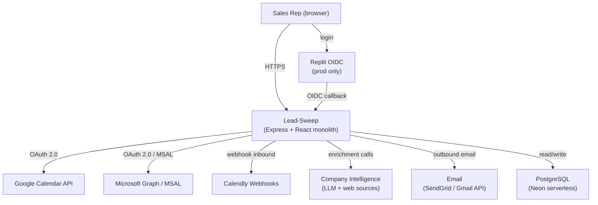
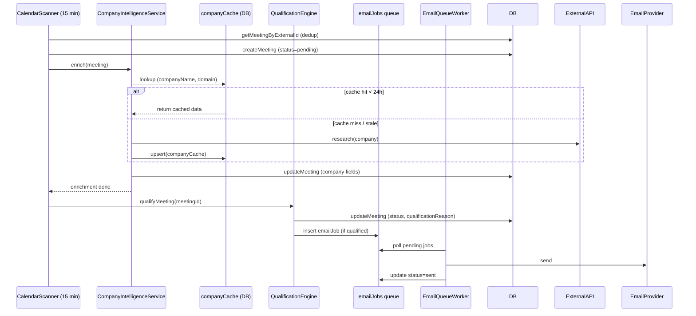

# Architecture Spine — Lead-Sweep

## Design Paradigm

**Layered monolith with in-process background workers.**

Single Node.js/Express process hosts all layers. Layers may only depend downward; no circular imports.

```
┌─────────────────────────────────────────┐
│  Client  (React SPA, Vite-served)       │
├─────────────────────────────────────────┤
│  API Layer  (server/routes.ts)          │
├─────────────────────────────────────────┤
│  Service Layer  (server/services/)      │
├─────────────────────────────────────────┤
│  Storage Interface  (server/storage.ts) │
├─────────────────────────────────────────┤
│  Database  (PostgreSQL via Drizzle ORM) │
└─────────────────────────────────────────┘
         Background workers (setInterval)
         live in Service Layer, fan-out per user
```

## Invariants & Rules

### AD-1 — Single-process monolith [ADOPTED]

- **Binds:** all services, background workers, API routes
- **Prevents:** building services that assume separate processes, external queues, or microservice boundaries in v1
- **Rule:** All server-side code runs in the same Node.js process started by `server/index.ts`. No spawned worker processes, no external job queues (e.g. BullMQ, Redis) until explicitly upgraded.

### AD-2 — Stack [ADOPTED]

- **Binds:** all new code
- **Prevents:** introducing a second language runtime, ORM, or router
- **Rule:** Server: Node.js 22 + Express + TypeScript ESM. Client: React 18 + Vite + Wouter + TanStack Query + Radix UI + Tailwind CSS. DB: PostgreSQL (Neon serverless) via Drizzle ORM. Shared types live in `shared/schema.ts` only.

### AD-3 — IStorage is the only persistence boundary [ADOPTED]

- **Binds:** all service classes in `server/services/`
- **Prevents:** two services writing to the same table through different code paths; direct Drizzle calls outside `storage.ts`
- **Rule:** Services receive `IStorage` via constructor injection. No service imports `db` directly. New tables require a corresponding method on `IStorage` before any service may use them.

### AD-4 — All user data scoped by userId [ADOPTED]

- **Binds:** every IStorage query method, every API route
- **Prevents:** cross-tenant data leakage
- **Rule:** Every DB read/write that touches user-owned data (`meetings`, `integrations`, `qualificationRules`, `emailJobs`, etc.) must filter by `userId`. The only exception is `getAllUsers()`, which is used exclusively by background fan-out workers and must never be called from request handlers.

### AD-5 — Calendar externalId carries source prefix [ADOPTED]

- **Binds:** F1 (Calendar Integration), any code routing calendar operations back to a provider
- **Prevents:** ambiguous externalId collisions across calendar providers
- **Rule:** `meetings.externalId` must be prefixed: `gcal_` (Google Calendar), `outlook_` (Outlook/MSAL), `calendly_` (Calendly). Code routing a delete or update to a provider strips the prefix before calling the provider API.

### AD-6 — All outbound email goes through the emailJobs queue [ADOPTED]

- **Binds:** F3 (Pre-Meeting Brief), F4 (Morning Briefing), F7 (Email Automation)
- **Prevents:** emails sent inline from request handlers (double-send on retry, lost on handler crash)
- **Rule:** Request handlers insert a row into `emailJobs` with `status='pending'`. The `email-queue` service polls and sends. No service may call an email provider (SendGrid, Gmail API) directly from a request handler.

### AD-7 — OAuth tokens stored only in integrations table [ADOPTED]

- **Binds:** F1 (Calendar Integration), Gmail integration
- **Prevents:** token leakage to client; tokens stored in `user.settings` or API responses
- **Rule:** `access_token` and `refresh_token` live only in `integrations.accessToken / refreshToken`. They are never included in API JSON responses and never copied to `users.settings`.

### AD-8 — Company intelligence routed through one service boundary

- **Binds:** F2 (Company Intelligence Engine), F3 (Pre-Meeting Brief), F4 (Morning Briefing)
- **Prevents:** LLM calls or external data API calls scattered across services; duplicate calls; cost explosion
- **Rule:** A single `CompanyIntelligenceService` owns all external research (web search, LLM enrichment, news APIs). No other service may call an LLM or external data enrichment API directly. Cache check happens inside this service before any external call. [ASSUMPTION: OpenAI is the LLM provider.]

### AD-9 — Company research cached 24 hours in DB

- **Binds:** AD-8 (CompanyIntelligenceService), F2, FR-2.8
- **Prevents:** redundant LLM/API calls for the same company across users or re-scans
- **Rule:** Research results are stored in a `companyCache` table keyed by normalized `(companyName, domain)`. TTL is 24 hours. Stale-while-revalidate: serve cached data immediately, queue background refresh if older than 24 hours. Cache writes go through IStorage (AD-3).

### AD-10 — Background workers use in-process setInterval fan-out [ADOPTED]

- **Binds:** `calendar-scanner`, `email-queue`, `morning-briefing`, `calendar-cleanup`, `invite-tracking`, `auto-reschedule`, `grooming-efficiency`
- **Prevents:** a second scheduling pattern (cron daemon, BullMQ) being introduced in parallel without an explicit upgrade decision
- **Rule:** Workers call `getAllUsers()`, filter by per-user settings, then process each user. Workers are registered in `server/index.ts` and called with `.startProcessing()`. New background work follows this pattern.

### AD-11 — Qualification runs after intelligence enrichment completes

- **Binds:** F2, F5 (Lead Qualification), `calendar-scanner`
- **Prevents:** qualifying a meeting with empty company/contact data
- **Rule:** `QualificationEngine.qualifyMeeting()` must not be called until `CompanyIntelligenceService.enrich()` has resolved for that meeting. The scanner pipeline is: import → enrich → qualify, in sequence per meeting.

### AD-12 — All API routes registered in server/routes.ts [ADOPTED]

- **Binds:** all API endpoints
- **Prevents:** hidden endpoints that bypass `isAuthenticated` middleware; routes defined inside service files
- **Rule:** Every HTTP route is registered in `server/routes.ts` inside `registerRoutes()`. Services expose methods, not Express handlers.

### AD-13 — Auth: Replit OIDC in production; local-dev bypass when REPLIT_DOMAINS absent [ADOPTED]

- **Binds:** all `isAuthenticated`-guarded routes
- **Prevents:** broken dev loop; running Replit OIDC locally
- **Rule:** `replitAuth.ts` checks `process.env.REPLIT_DOMAINS`. When absent, `isAuthenticated` auto-passes every request as `local-dev-user-123`. Production always requires Replit OIDC. Subscription tier enforcement is deferred (see Deferred).

---

## Consistency Conventions

| Concern | Convention |
| --- | --- |
| File naming | `kebab-case` for all files and directories |
| Service classes | PascalCase class, singleton export at file bottom (e.g. `export const calendarScannerService = new CalendarScannerService()`) |
| API routes | `REST`, noun-first, plural: `/api/meetings`, `/api/calendar-integrations/:type` |
| Error responses | `{ message: string }` JSON, appropriate HTTP status; never leak stack traces |
| Dates | UTC everywhere in DB and API; formatted only at the UI layer |
| externalId | Always prefixed with source (`gcal_`, `outlook_`, `calendly_`) — see AD-5 |
| TypeScript | Strict mode (`"strict": true`); no `any` in new code except explicit escape hatches |
| Shared types | All DB-derived types exported from `shared/schema.ts`; no type duplication between client and server |
| Environment config | All secrets and config read from `process.env`; `.env` loaded via `dotenv/config` in `server/index.ts`; never hardcoded |
| State mutation | All writes go through IStorage (AD-3); no optimistic local mutation in services |

---

## Stack

| Name | Version |
| --- | --- |
| Node.js | 22.x |
| TypeScript | 5.6.3 |
| Express | 4.x |
| React | 18.3.x |
| Vite | 5.4.x |
| Wouter | 3.3.x |
| TanStack Query | 5.x |
| Radix UI | 1.x–2.x (per component) |
| Tailwind CSS | 3.4.x |
| Drizzle ORM | 0.39.x |
| PostgreSQL | Neon serverless (latest) |
| OpenAI SDK | 5.x [ASSUMPTION] |
| googleapis | 150.x |
| @azure/msal-node | 3.x |
| SendGrid | 8.x |
| dotenv | 17.x |
| zod | 3.x |

---

## Structural Seed

### System context



### Core data flow — meeting lifecycle



### Source tree (seed)

```text
/
├── client/
│   └── src/
│       ├── pages/          # Route-level components (one per page)
│       ├── components/     # Shared UI components
│       ├── hooks/          # Custom React hooks
│       └── lib/            # queryClient, authUtils, utils
├── server/
│   ├── index.ts            # Entry point; registers routes, starts workers
│   ├── routes.ts           # ALL API routes (AD-12)
│   ├── storage.ts          # IStorage impl — single DB write path (AD-3)
│   ├── db.ts               # Drizzle client init
│   ├── replitAuth.ts       # Auth middleware (AD-13)
│   └── services/
│       ├── company-intelligence.ts   # TO BUILD — AD-8 boundary
│       ├── calendar-scanner.ts
│       ├── qualification-engine.ts
│       ├── email-queue.ts
│       ├── morning-briefing.ts
│       ├── pre-meeting-summary.ts
│       ├── google-calendar-integration.ts
│       ├── outlook-integration.ts
│       └── ...
├── shared/
│   └── schema.ts           # DB schema + all shared types (AD-2)
└── _bmad-output/           # BMad planning artifacts
```

---

## Capability → Architecture Map

| Capability | Lives in | Governed by |
| --- | --- | --- |
| F1 Calendar Integration | `services/calendar-scanner`, `services/google-calendar-integration`, `services/outlook-integration` | AD-1, AD-5, AD-10 |
| F2 Company Intelligence Engine | `services/company-intelligence` (TO BUILD) | AD-8, AD-9, AD-11 |
| F3 Pre-Meeting Brief | `services/pre-meeting-summary` + `emailJobs` | AD-6, AD-8, AD-11 |
| F4 Morning Briefing | `services/morning-briefing` | AD-6, AD-10 |
| F5 Lead Qualification | `services/qualification-engine` | AD-3, AD-11 |
| F6 Post-Meeting Tracking | `routes.ts` + `storage.ts` | AD-4, AD-6 |
| F7 Email Automation | `services/email-queue`, `services/email-service`, `services/gmail-service` | AD-6, AD-7 |
| F8 Analytics | `routes.ts` + `storage.ts` (aggregation queries) | AD-4 |
| F9 Subscriptions / SaaS | TO BUILD — Stripe integration | AD-13 (deferred tier enforcement) |

---

## Deferred

| Decision | Reason it can wait | Revisit when |
| --- | --- | --- |
| Company intelligence data sources (Clearbit, Apollo, Crunchbase API, web search) | Depends on cost/quality tradeoff; unblocked until CompanyIntelligenceService boundary (AD-8) is built | Before F2 implementation sprint |
| Stripe subscription tier enforcement | No paying users yet; auth middleware point TBD | Before public launch / F9 sprint |
| Background worker durability (upgrade from setInterval to BullMQ/Redis or Inngest) | In-process is sufficient for single-server Neon-backed v1 | When process restarts cause noticeable job loss in production |
| Role-based access control (manager vs rep) | F8 manager view is the only multi-role feature; PRD marks it secondary | Before F8 team analytics sprint |
| `companyCache` schema | AD-9 fixes the pattern; exact columns deferred until F2 sprint | Before CompanyIntelligenceService is implemented |
| Native mobile / CRM integration | Explicitly out of scope v1 per PRD | Post-launch |
